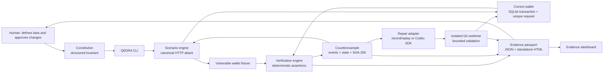

# QEDRA

> Autonomous code must prove itself.

QEDRA is an open-core evidence layer for autonomous software engineering. It turns a non-negotiable software law into an executable invariant, attacks a real application with a reproducible counterexample, runs a bounded repair workflow in an isolated Git worktree, replays the exact attack, and emits a machine-verifiable evidence passport for a human reviewer.

The v0.1 vertical slice protects one payment law end to end:

> **TRANSFER_IDEMPOTENCY** — The same transfer request must never debit a wallet more than once, including after a network timeout, client retry, duplicate callback, or concurrent duplicate request.

The default judge path is deterministic and needs no OpenAI credential. Live repair is implemented with the official `@openai/codex-sdk`, but remains explicitly opt-in. No live API invocation or model metric is claimed when authentication is absent.

## Why QEDRA

AI-generated code can look plausible while violating a business law under failure conditions. A review comment or model statement is not proof. QEDRA makes the claim falsifiable:

1. qualify a structured law;
2. execute a canonical adversarial HTTP sequence;
3. preserve the observed violation and its SHA-256 hash;
4. constrain a repair to an isolated worktree and an allowed file set;
5. run deterministic validation rather than trusting the agent response;
6. replay the same requests, in the same order, with the same canonical request hash;
7. attest the results in JSON and standalone HTML while keeping human approval mandatory.

The operating cycle is:

> Qualify → Execute → Detect → Repair → Attest

## Three-minute proof

The bundled wallet starts with 10,000 FCFA in wallet A and 5,000 FCFA in wallet B. The adversarial scenario sends `TX-001`, forces a timeout after the transfer commits, then retries the exact request.

| Observation      | Lawful state | Vulnerable fixture | Repaired implementation |
| ---------------- | -----------: | -----------------: | ----------------------: |
| Wallet A         |   9,000 FCFA |         8,000 FCFA |              9,000 FCFA |
| Wallet B         |   6,000 FCFA |         7,000 FCFA |              6,000 FCFA |
| `TX-001` debits  |            1 |                  2 |                       1 |
| `TX-001` credits |            1 |                  2 |                       1 |
| Invariant        |         PASS |               FAIL |                    PASS |

Run the complete credential-free flow:

```powershell
pnpm install --frozen-lockfile
pnpm demo
pnpm evidence:verify
```

`pnpm demo` intentionally observes the vulnerable failure, replays a recorded repair in a temporary Git worktree, validates the repair, replays the exact attack against the fixed behavior, and generates:

- `evidence/counterexample.json`
- `evidence/repair-request.json`
- `evidence/repair-report.json`
- `evidence/repair.diff`
- `evidence/replay-result.json`
- `evidence/passport.json`
- `evidence/passport.html`
- `apps/evidence-dashboard/public/data.json`
- `apps/evidence-dashboard/public/index.html`

The repair is evidence for review, not authorization to merge. Every repair result keeps `humanApprovalRequired: true`, `approvalStatus: "PENDING"`, `committed: false`, and `merged: false`.

## Architecture



The corrected wallet stores the first transfer result under a unique `request_id`. A `BEGIN IMMEDIATE` transaction checks for that result before mutating balances, writes the ledger and response atomically, and returns the stored first response for all repeats. The deliberately vulnerable behavior remains isolated under `examples/vulnerable-wallet-api/` so the failure stays reproducible.

See [Architecture](docs/architecture.md) for components, trust boundaries, persistence, and evidence flow.

## Repository map

| Path                              | Responsibility                                                 |
| --------------------------------- | -------------------------------------------------------------- |
| `packages/constitution/`          | Strict constitution schema and initialization                  |
| `packages/scenario-engine/`       | Canonical timeout-after-commit attack and exact replay         |
| `packages/verification-engine/`   | Deterministic `TRANSFER_IDEMPOTENCY` assertions                |
| `packages/core/`                  | Correct Fastify/SQLite wallet implementation                   |
| `examples/vulnerable-wallet-api/` | Preserved vulnerable fixture                                   |
| `packages/codex-adapter/`         | Official Codex SDK and deterministic record/replay adapters    |
| `packages/git-adapter/`           | Isolated worktree execution, diff capture, validation, cleanup |
| `packages/proof-passport/`        | Evidence schemas, canonical hashes, JSON and HTML passport     |
| `packages/cli/`                   | Stable command and exit-code surface                           |
| `apps/evidence-dashboard/`        | Static, credential-free evidence dashboard                     |
| `apps/demo-wallet-flutter/`       | Minimal companion client for the before/after wallet story     |
| `constitutions/`                  | Executable software laws                                       |
| `evidence/`                       | Runtime proof artifacts                                        |
| `reports/`                        | Runtime and validation reports                                 |

## Requirements and supported platforms

The verified development baseline is Windows 11 with Node.js 24.18.0, pnpm 11.13.0, Git 2.43.0, Docker Desktop 29.0.1, Flutter 3.44.2, and Dart 3.12.2. The TypeScript proof loop uses standard Node.js and Git primitives and is exercised by CI on GitHub-hosted Linux. Node 24 is required because the wallet uses the built-in `node:sqlite` module.

Do not upgrade the pinned toolchain as part of setup.

```powershell
node --version
pnpm --version
git --version
pnpm install --frozen-lockfile
```

## CLI

```text
qedra doctor
qedra init
qedra verify [TRANSFER_IDEMPOTENCY]
qedra attack [TRANSFER_IDEMPOTENCY]
qedra repair [TRANSFER_IDEMPOTENCY] [--replay | --live]
qedra passport [--verify]
qedra demo --replay
```

Use `--json` for one machine-readable JSON document. With pnpm, `--silent` prevents the package-runner preamble from contaminating stdout:

```powershell
pnpm --silent qedra doctor --json
pnpm --silent qedra init --json
pnpm --silent qedra attack TRANSFER_IDEMPOTENCY --json
pnpm --silent qedra repair TRANSFER_IDEMPOTENCY --replay --json
pnpm --silent qedra passport --verify --json
```

The attack command returns exit code `10` when it confirms the violation. That non-zero result is the intended proof outcome, not a harness crash.

| Exit code | Meaning                                            |
| --------: | -------------------------------------------------- |
|       `0` | Command completed successfully or invariant passed |
|      `10` | Deterministic invariant violation confirmed        |
|      `20` | Usage or configuration error                       |
|      `30` | Execution or deterministic validation failed       |
|      `40` | Live repair blocked by missing authentication      |

## Executable constitution

`constitutions/qedra.yaml` is both human-readable and schema-validated:

```yaml
schemaVersion: 1.0.0
name: QEDRA Constitution
invariants:
  - id: TRANSFER_IDEMPOTENCY
    version: 1
    severity: critical
    enabled: true
    statement: >-
      The same transfer request must never debit a wallet more than once,
      including after a network timeout, client retry, duplicate callback,
      or concurrent duplicate request.
    scenario:
      id: timeout-after-commit-retry
      expectedState:
        sourceBalance: 9000
        destinationBalance: 6000
        debitEntries: 1
        creditEntries: 1
```

## Counterexample

The counterexample is a strict, hashed artifact. It records the invariant, deterministic seed, canonical attack hash, ordered request/response events, expected and actual state, ledger entries, affected files, reproduction command, Git metadata, timestamp, and evidence hash.

```json
{
  "schemaVersion": "1.0.0",
  "kind": "qedra.counterexample",
  "invariant": { "id": "TRANSFER_IDEMPOTENCY" },
  "scenario": {
    "id": "transfer-timeout-after-commit-retry",
    "deterministicSeed": "qedra-transfer-idempotency-seed-v1",
    "targetId": "vulnerable-wallet-api"
  },
  "expectedState": {
    "balances": { "A": 9000, "B": 6000 },
    "debitEntries": 1,
    "creditEntries": 1
  },
  "actualState": {
    "balances": { "A": 8000, "B": 7000 },
    "debitEntries": 2,
    "creditEntries": 2
  }
}
```

The excerpt omits required fields for readability. The generated artifact is authoritative and validates against the complete schema.

## Repair modes

### Deterministic record/replay

This is the default demo path. QEDRA binds a reviewed recorded change set to the repair request, invariant, affected paths, base commit, and patch hash. It applies that patch only inside a detached temporary worktree, runs the non-regression test and exact-attack verification, captures the resulting diff, and removes the worktree. A path policy rejects traversal, `.git` mutation, unexpected files, mismatched base commits, and tampered patch hashes.

```powershell
pnpm --silent qedra attack TRANSFER_IDEMPOTENCY --json
# Expected exit code: 10
pnpm --silent qedra repair TRANSFER_IDEMPOTENCY --replay --json
```

### Live Codex SDK repair

The live adapter uses the official `@openai/codex-sdk`. It starts each attempt inside the declared isolated worktree with workspace-only writes, no interactive approvals, and network access disabled for the repair sandbox. The request permits at most three attempts, 120 seconds per attempt, and two consecutive no-progress assessments. The adapter also enforces hard upper bounds, cancellation, deterministic post-attempt validation, and no merge or commit.

Live mode is currently **implemented but not executed in the Genesis evidence run** because no `OPENAI_API_KEY` was supplied. QEDRA records this as an external authentication blocker and continues all credential-free phases. It never invents a Codex response, model name, token count, cost, call ID, or success.

To enable live mode later, provide the key only in the process environment or an ignored `.env.local` file, confirm readiness with `doctor`, then opt in:

```powershell
$env:OPENAI_API_KEY = "<your key>"
pnpm --silent qedra doctor --json
pnpm --silent qedra attack TRANSFER_IDEMPOTENCY --json
pnpm --silent qedra repair TRANSFER_IDEMPOTENCY --live --json
```

QEDRA detects only presence and source; it never prints or stores the value in evidence. Do not commit `.env`, `.env.local`, or credentials. Account setup, key creation, billing, and authorization remain human responsibilities.

See [Codex collaboration](docs/codex-collaboration.md) for the exact trust contract.

## Evidence passport and dashboard

`qedra passport` creates:

- a canonical JSON passport with repository metadata, stage results, artifact SHA-256 values, observable metrics, limitations, and `humanApprovalRequired: true`;
- a dependency-free HTML passport that embeds the canonical evidence and verifies the passport and repair hashes;
- static dashboard data for the protected law, initial state, attack timeline, expected-versus-actual comparison, repair status, replay identity, artifact integrity, and pending human approval.

Verify the generated bundle independently:

```powershell
pnpm evidence:verify
```

Unknown metrics are serialized as `null`, never estimated. Runtime artifacts under `evidence/` and generated dashboard data are intentionally ignored by Git; CI uploads them as run artifacts.

## Human and agent decisions

| Decision                             | Human             | QEDRA / agent                    |
| ------------------------------------ | ----------------- | -------------------------------- |
| Define the non-negotiable law        | Owns              | Represents and validates it      |
| Choose repository and allowed paths  | Owns              | Enforces the boundary            |
| Generate or propose a repair         | Reviews           | May produce changes in isolation |
| Decide PASS or FAIL                  | Consumes evidence | Deterministic code decides       |
| Approve, commit, or merge repair     | Owns exclusively  | Never performs automatically     |
| Create credentials or enable billing | Owns exclusively  | Detects availability only        |

## Testing

Run the complete local gate:

```powershell
pnpm install --frozen-lockfile
pnpm format:check
pnpm lint
pnpm typecheck
pnpm test:unit
pnpm test:integration
pnpm test:adversarial
pnpm test:e2e
pnpm build
pnpm demo
pnpm evidence:verify
git status --short
```

The suite covers invariant evaluation, canonical hashing, schema validation, passport tamper detection, timeout-after-commit, concurrent duplicate requests, persistent idempotency across database reopen, vulnerable failure, fixed success, SDK authentication and bounds, change-set rejection, worktree isolation, dashboard generation, CLI exit codes, and the deterministic demo.

See [Testing instructions](docs/testing-instructions.md) for expected outcomes and focused commands.

## Security and cost controls

- Credentials are presence-checked without disclosure and excluded from evidence.
- Repair writes are limited to an isolated worktree and declared files.
- Git history is not rewritten; repairs are neither committed nor merged.
- Commands have timeouts, output limits, cancellation, attempt limits, and no-progress detection.
- Counterexamples, patches, and passport structures are canonicalized and hashed.
- Model calls, tokens, costs, and budgets are recorded only when directly observable; otherwise fields remain `null`.
- Default CI and the judge demo require no private secret.
- Live CI is a manual, secret-protected opt-in and is disabled by default.

Review the residual risks and mitigations in the [Threat model](docs/threat-model.md).

## Open-core model

The community core is Apache-2.0 and includes constitutions, deterministic attacks, local verification, repair contracts, isolated replay, schemas, the CLI, and portable evidence passports. A future commercial layer may add organization policy management, hosted evidence retention, fleet dashboards, governance workflows, and enterprise integrations without weakening the local proof boundary.

## Current limitations

- QEDRA v0.1 protects one invariant and one canonical wallet scenario.
- The live Codex path requires explicit `OPENAI_API_KEY` authentication and was not invoked in the credential-free Genesis run.
- Record/replay demonstrates the same repair boundary and validators, but it is not represented as a live model result.
- The static dashboard is an evidence viewer, not an approval or merge control plane.
- The Flutter app is a minimal demo client, not a production wallet.
- A SHA-256 passport proves artifact integrity and provenance claims within the recorded Git context; it is not a cryptographic signature or remote attestation.
- Human review remains required before applying any repair to the source branch.

## Roadmap

1. Add invariant templates for authorization, money conservation, privacy, and API compatibility.
2. Sign passports with workload identity and transparency-log inclusion proofs.
3. Add sandbox backends and policy-as-code for larger polyglot repositories.
4. Evaluate live Codex repair quality with authorized, reproducible datasets and explicit budgets.
5. Add organization-level evidence retention, review queues, and CI policy gates.

## Documentation

- [Architecture](docs/architecture.md)
- [Judge demo script](docs/demo-script.md)
- [Testing instructions](docs/testing-instructions.md)
- [Codex collaboration](docs/codex-collaboration.md)
- [Threat model](docs/threat-model.md)
- [Genesis mission log](docs/genesis-run.md)
- [Résumé français](docs/fr/README.fr.md)

## License

QEDRA community core is licensed under the [Apache License 2.0](LICENSE).
