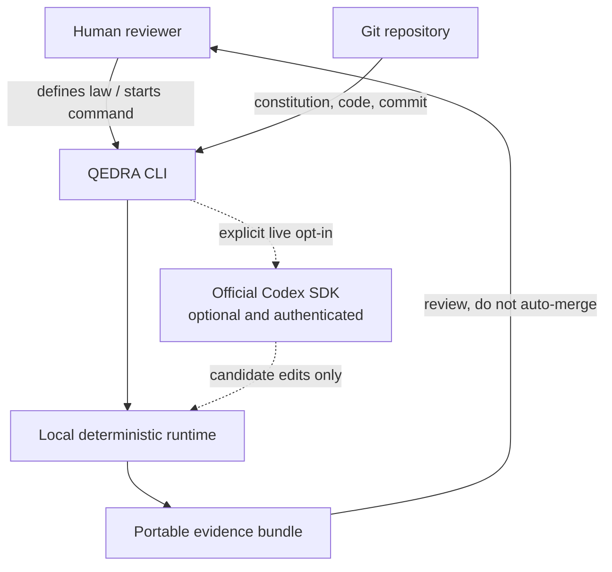
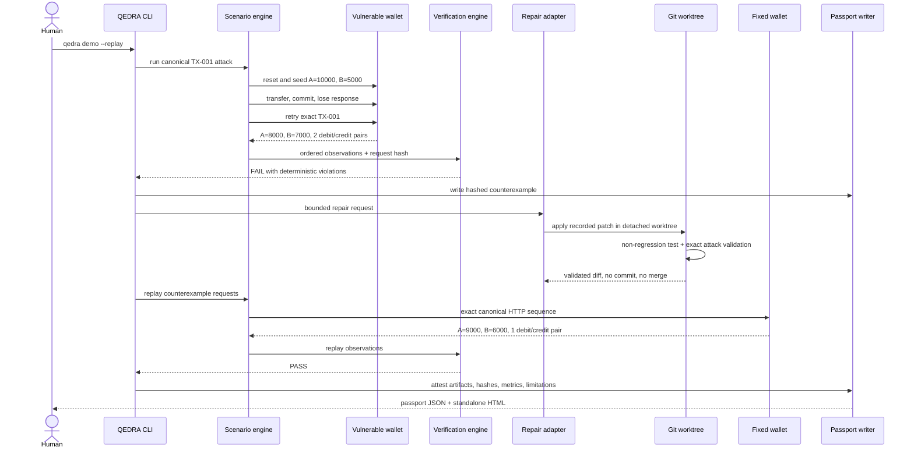
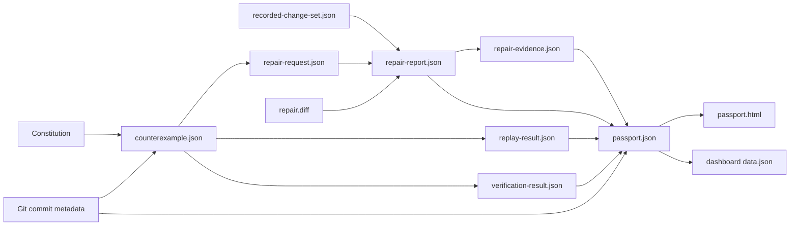

# QEDRA v0.1 Architecture

## Objective

QEDRA is a local-first evidence layer for autonomous software engineering. Its primary architectural rule is that an agent may propose a change, but only deterministic execution may establish PASS or FAIL. The v0.1 slice proves this rule against `TRANSFER_IDEMPOTENCY` with a real wallet service, a reproducible timeout/retry attack, an isolated repair workflow, exact replay, and a hashed evidence passport.

The proof loop is:

> Law → Attack → Counterexample → Repair → Replay → Evidence

## System context

The deterministic runtime is authoritative. Codex is outside the proof boundary: its response can create candidate edits, but its prose cannot mark an invariant as passed.

## Components

| Component                        | Responsibility                                                                          | Authoritative output                           |
| -------------------------------- | --------------------------------------------------------------------------------------- | ---------------------------------------------- |
| `packages/constitution`          | Parse and validate executable laws                                                      | Validated constitution                         |
| `packages/scenario-engine`       | Define, execute, hash, and replay canonical HTTP attacks                                | Ordered scenario run and request hash          |
| `packages/verification-engine`   | Compare observed wallet state with the invariant                                        | PASS/FAIL and violations                       |
| `packages/core`                  | Correct wallet API and persistent SQLite idempotency                                    | Balances, ledger, stored first response        |
| `examples/vulnerable-wallet-api` | Preserve the double-debit failure as a fixture                                          | Reproducible violation                         |
| `packages/codex-adapter`         | Build bounded repair contracts; execute live SDK or recorded replay                     | Candidate repair result, never proof by itself |
| `packages/git-adapter`           | Create a detached worktree, enforce path policy, run validators, capture diff, clean up | Validation results and exact patch             |
| `packages/proof-passport`        | Validate schemas, canonicalize, hash, render standalone HTML                            | Counterexample, repair evidence, passport      |
| `packages/cli`                   | Orchestrate commands with stable exits and JSON output                                  | User and automation interface                  |
| `apps/evidence-dashboard`        | Render a static view of evidence artifacts                                              | Static `index.html` and `data.json`            |
| `apps/demo-wallet-flutter`       | Present the before/after wallet story                                                   | Minimal demo UI                                |

## Vertical-slice sequence

## Canonical attack identity

The scenario definition contains six ordered operations:

1. reset;
2. seed wallet A with 10,000 FCFA and wallet B with 5,000 FCFA;
3. submit `TX-001` for 1,000 FCFA with `timeout-after-commit` failure injection;
4. retry the same `TX-001` payload;
5. read balances;
6. read ledger entries for `TX-001`.

Requests use canonical JSON body serialization. The scenario engine hashes the ordered request sequence with SHA-256. Replay validates invariant ID, scenario ID, deterministic seed, event order, event names, expected status codes, and the canonical request hash before executing it against the fixed target. This prevents a repair from being validated against a weaker or different attack.

## Wallet persistence and transaction model

The corrected implementation uses Node's built-in SQLite driver and three tables:

- `wallets(wallet_id PRIMARY KEY, balance)`;
- `transfers(request_id PRIMARY KEY, ..., response_json)`;
- `ledger(id PRIMARY KEY, request_id, wallet_id, direction, amount, balance_after)`.

Each transfer begins with `BEGIN IMMEDIATE`. Within that transaction, the store:

1. checks `transfers` for the unique `request_id`;
2. returns the stored response immediately when it exists;
3. validates both wallets and sufficient funds;
4. updates both balances;
5. writes exactly one debit and one credit ledger entry;
6. stores the complete first response under the unique request ID;
7. commits atomically.

The immediate transaction serializes competing writers, while the unique request key and stored response preserve idempotency across retries, concurrent calls, database connections, and process reopen.

The vulnerable fixture intentionally omits durable deduplication. It stays separate from the corrected core so the counterexample remains executable without weakening production behavior.

## Repair boundary

Every repair request records:

- invariant and scenario identity;
- counterexample path and SHA-256;
- reproduction command;
- repository path, immutable base commit, and isolated worktree path;
- explicit affected files;
- deterministic validation commands;
- maximum attempts, per-attempt timeout, and no-progress limit;
- `humanApprovalRequired: true`.

The Git adapter creates a detached worktree from the recorded base commit. Candidate changes are rejected if they target `.git`, use path traversal, escape the affected-file allowlist, mismatch the base commit, or produce a different patch than the bound recorded change set. Validation output is bounded and captured. Cleanup runs even after failure. The source worktree is not modified, committed, merged, or pushed.

### Deterministic record/replay

The credential-free path binds a recorded, hash-bound patch to its request ID, invariant ID, base commit, affected-file list, and content hash. The patch is applied and validated through the same worktree controls used for live candidates. Record/replay is identified honestly in every artifact; it is never labeled as a live Codex result.

### Live Codex SDK

The live adapter uses `@openai/codex-sdk`. It only starts after safe presence detection for `OPENAI_API_KEY`, and only inside the declared worktree. The SDK thread is constrained to workspace writes, an `approvalPolicy` of `never`, and disabled network access inside the repair sandbox. Each attempt is time-bounded and cancellable. Deterministic validators run after each attempt; unchanged workspace fingerprints trigger no-progress termination.

The Genesis run does not provide authentication. Therefore the live path returns `AUTHENTICATION_REQUIRED` without starting a thread, while all deterministic phases remain available.

## Evidence model

Evidence objects are strict Zod schemas. Canonical JSON hashing omits only the object's own `evidenceHash` field. Artifact references use SHA-256 over the actual file bytes. The passport includes stage status, Git metadata, reproduction commands, limitations, and observable metrics. Metrics that cannot be observed remain `null`.

The HTML passport is standalone and embeds the canonical evidence. It verifies the internal passport and repair evidence hashes while rendering. `qedra passport --verify` additionally validates the JSON schema, internal hashes, and referenced artifact hashes.

SHA-256 detects mutation; it is not a signature. A future design may add workload-identity signatures and transparency logs.

## Trust boundaries

1. **Human policy boundary:** only a human defines the law, supplies credentials, expands allowed paths, and approves integration.
2. **Repository boundary:** QEDRA reads the selected repository and writes runtime artifacts only to declared local paths.
3. **Repair boundary:** untrusted candidate edits run in a temporary Git worktree with bounded commands.
4. **Credential boundary:** only presence and source are observable in QEDRA output; validation child processes remove API credential variables, and values are never written to evidence.
5. **Proof boundary:** scenario requests, process exit codes, assertions, stored state, diffs, and hashes are authoritative. Agent text is not.
6. **Presentation boundary:** the dashboard and HTML passport render evidence but cannot approve or merge a change.

## Failure semantics

The CLI distinguishes a confirmed law violation from a harness failure:

| Exit | Semantics                                                |
| ---: | -------------------------------------------------------- |
|  `0` | Success or verified PASS                                 |
| `10` | Confirmed invariant violation                            |
| `20` | Invalid usage or configuration                           |
| `30` | Execution or validation failure                          |
| `40` | Live repair unavailable because authentication is absent |

Evidence is written atomically. Important failures are preserved as structured artifacts where possible. A missing live credential is an external blocker for live repair only, not for attack, record/replay repair, replay, verification, dashboard, or passport generation.

## Deployment and portability

QEDRA v0.1 is a local CLI and static evidence viewer. It does not require a hosted control plane. The proof loop requires Node.js 24, pnpm, and Git. Docker is diagnostic/optional for this slice. The Flutter app is a separate presentation client. Default GitHub Actions run without an OpenAI secret and upload generated evidence as workflow artifacts.
