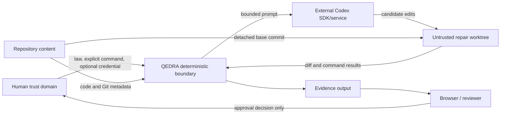

# QEDRA v0.1 Threat Model

## Scope

This threat model covers the QEDRA CLI, wallet proof fixture, deterministic attack and verification engines, Codex repair adapter, Git worktree runner, evidence passport, static dashboard, local runtime artifacts, and GitHub Actions workflow.

It does not claim to secure a production payment system, a hostile operating-system administrator, the OpenAI service, GitHub's infrastructure, or a compromised dependency registry. The protected security property in v0.1 is transfer idempotency under timeout, retry, duplicate callback, and concurrent duplicate request behavior.

## Security objectives

1. A repeated `request_id` cannot cause a second debit in the corrected wallet.
2. The vulnerable failure remains reproducible without contaminating the corrected implementation.
3. Candidate edits remain isolated; Git-history changes, `.git` damage, commits, and undeclared-file changes are detected and rejected rather than promoted.
4. Only deterministic validators can establish repair success.
5. Evidence mutation is detectable through schemas and SHA-256 hashes.
6. API credential values do not enter QEDRA product output or evidence, and validation children cannot inherit them.
7. Missing authentication blocks only live repair and cannot cause a fabricated live result.
8. Human approval remains required before integration.

## Assets

| Asset                                | Why it matters                                     |
| ------------------------------------ | -------------------------------------------------- |
| Constitution                         | Defines the non-negotiable law and expected state  |
| Source repository and Git history    | Must not be silently changed by repair execution   |
| Wallet balances and ledger           | Determine whether value was duplicated or lost     |
| Idempotency result store             | Ensures retries return the first committed result  |
| Counterexample                       | Reproduces the confirmed failure                   |
| Recorded/live repair request         | Defines repair scope and execution bounds          |
| Captured patch and validation output | Describe exactly what was tested                   |
| Passport and artifact hashes         | Support reviewer verification                      |
| `OPENAI_API_KEY`                     | Authorizes external model usage and may incur cost |
| CI environment and artifacts         | Provide independent, credential-free validation    |

## Actors

- **Human maintainer:** trusted to define policy, supply credentials deliberately, review evidence, and approve integration.
- **QEDRA deterministic runtime:** trusted only to the extent of reviewed source, local toolchain, and executed tests.
- **Codex repair agent:** untrusted candidate-code producer; never a proof authority.
- **Recorded change set:** untrusted input until its schema, base commit, paths, and hash validate.
- **Repository content:** potentially malicious or simply buggy; vulnerable fixture is deliberately adversarial.
- **Dependency or CI provider:** external supply-chain and execution dependency.
- **Artifact viewer:** may open locally generated HTML containing evidence-derived values.

## Trust boundaries



No candidate edit crosses from the temporary worktree to the source branch automatically. No presentation component can authorize a commit or merge.

## Threats and controls

| ID  | Threat                                                 | Control                                                                                                            | Residual risk                                                                  |
| --- | ------------------------------------------------------ | ------------------------------------------------------------------------------------------------------------------ | ------------------------------------------------------------------------------ |
| T1  | Retry causes duplicate debit                           | Unique `transfers.request_id`, stored response, `BEGIN IMMEDIATE`, atomic balance/ledger/result writes             | A database or runtime defect outside covered scenarios could remain            |
| T2  | Concurrent duplicate races past deduplication          | Immediate writer transaction plus unique primary key; cross-connection tests                                       | SQLite deployment/filesystem semantics must match supported environments       |
| T3  | Attack is changed after repair to obtain PASS          | Canonical ordered request hash, scenario/seed/event/status validation, exact replay assertion                      | A bug shared by recorder and verifier could mask change                        |
| T4  | Counterexample or passport is edited                   | Strict schemas, canonical internal hashes, referenced-file byte hashes                                             | SHA-256 is integrity detection, not signer identity                            |
| T5  | Agent claims success without a working repair          | Agent text ignored; deterministic validators and exit codes decide                                                 | Validators may be incomplete for laws not yet modeled                          |
| T6  | Candidate repair escapes repository scope              | Detached worktree, normalized repository-relative paths, affected-file allowlist, `.git` rejection                 | A vulnerability in Git, Node, or path handling could bypass policy             |
| T7  | Candidate rewrites history, commits, or merges         | Worktree callback exposes bounded Git use; result contract requires no commit/merge; head/base checks and cleanup  | A compromised host process has broader authority than the application model    |
| T8  | Malicious patch differs from reviewed recording        | Patch content SHA-256, request/invariant/base binding, captured-diff equality                                      | Approved recording itself may contain a logical vulnerability                  |
| T9  | Repair process hangs or floods output                  | Per-command timeout, attempt timeout, cancellation, attempt limit, no-progress limit, output truncation            | Child-process termination depends on operating-system behavior                 |
| T10 | API key leaks through diagnostics or validation output | Presence-only detector, private loader, validation-child credential removal, no key in evidence                    | SDK or host-level tracing outside QEDRA may observe its controlled environment |
| T11 | Missing key is hidden by fabricated results            | Structured `AUTHENTICATION_REQUIRED`, no thread start, nullable/absent metrics                                     | Reviewer must distinguish record/replay from live mode                         |
| T12 | Live model accesses network or asks for approval       | SDK thread uses workspace writes, `approvalPolicy: never`, sandbox network disabled                                | The external service remains a separate trust domain                           |
| T13 | Prompt injection in repository content expands action  | Hard-coded policy prompt, allowed paths, worktree boundary, deterministic validators                               | Model may waste bounded attempts or produce harmful allowed-file edits         |
| T14 | Evidence HTML executes injected content                | HTML escaping, no external scripts, standalone rendering                                                           | Browser implementation vulnerabilities are out of scope                        |
| T15 | Dashboard presents stale or inconsistent artifacts     | Schema-validated inputs, integrity checks, request-hash comparison, generated timestamp                            | Static files can be viewed after source/evidence changes unless regenerated    |
| T16 | Default CI leaks or requires secrets                   | Pull-request job has read-only contents permission and no secret dependency; live job is manual and off by default | Third-party actions are supply-chain dependencies                              |
| T17 | Secret from a fork reaches live CI                     | Live job only on explicit `workflow_dispatch`, repository secret, manual boolean                                   | Authorized maintainer can still opt in incorrectly                             |
| T18 | Generated evidence or local databases are committed    | `.gitignore`, dedicated `evidence/` and `reports/runtime/`, final Git status review                                | A maintainer can override ignore rules manually                                |
| T19 | Vulnerable fixture is used as production code          | Separate `examples/vulnerable-wallet-api` location, explicit target flag, documentation                            | Consumers may ignore warnings or copy fixture code                             |
| T20 | Dependency compromise affects proof                    | Exact lockfile, frozen install, controlled dependency set, CI validation                                           | Locking a compromised version does not make it trustworthy                     |

## Credential lifecycle

`OPENAI_API_KEY` is optional and never required by the default demo or CI. QEDRA checks process environment first, then ignored `.env.local` and `.env` files. It reports only boolean presence and source category.

The credential loader maps the key into the controlled SDK environment only after explicit `repair --live`. Evidence records whether a key was detected and whether a live invocation was attempted, never the key value. Users should prefer short-lived process environment configuration and remove it after use.

Key creation, ownership, rotation, billing configuration, access policy, and revocation remain outside QEDRA and require human action.

## Repair execution policy

The repair adapter must reject execution unless:

- the repository has a full committed base SHA;
- the worktree path differs from the source repository;
- the worktree exists as a Git worktree;
- limits are within hard bounds;
- all affected paths are normalized, relative, and allowed;
- the patch binds to the same request, invariant, and base;
- validation commands are declared before mutation.

A successful repair means only that the candidate diff passed the configured validators in isolation. It does not imply broad correctness, production safety, legal approval, or permission to merge.

## Evidence security

Evidence uses atomic file writes to reduce partial-artifact risk. Internal hashes cover canonical object content without the object's own hash field. Artifact references hash actual bytes. Repository metadata records the commit and branch when observable.

Reviewers should run:

```powershell
pnpm evidence:verify
git status --short
```

before relying on a bundle. Evidence copied away from the repository should be transferred with all referenced artifacts. Because passports are not signed, a malicious party able to replace both content and all hashes can create a different internally consistent bundle. The recorded Git commit and trusted CI provenance are therefore important review context.

## CI security

Default `push` and `pull_request` jobs use:

- read-only repository contents permission;
- exact Node and pnpm versions;
- frozen lockfile installation;
- formatting, lint, type, unit, integration, adversarial, e2e, build, demo, and evidence gates;
- evidence upload after the credential-free demo.

The live repair job is available only through manual dispatch with a boolean that defaults to false. It consumes `OPENAI_API_KEY` only in that job. Pull requests never receive or require it. A skipped live job is neutral, not a verified live result.

## Denial of service and cost

QEDRA limits repair attempts, attempt duration, command duration, output bytes, unchanged-workspace attempts, and scenario count. Cancellation is propagated. Live model calls occur only after explicit opt-in and authentication.

Token usage and costs are recorded only when observable. QEDRA does not infer price or fabricate missing metrics. v0.1 does not implement a remote billing kill switch; account-level quotas and billing limits remain human-managed external controls.

## Residual risks and future work

- The single invariant does not prove general wallet correctness.
- Shared implementation bugs between scenario generation and replay are possible.
- SHA-256 integrity lacks signer identity and trusted timestamping.
- A compromised host, Node runtime, Git executable, SQLite library, or dependency can invalidate local evidence.
- Allowed-file edits may still be malicious while passing incomplete validators.
- The live SDK path needs an authorized real-world evaluation before claims about model quality, latency, tokens, or cost.
- Static HTML evidence can become stale after repository changes.

Planned mitigations include signed attestations, transparency-log publication, independent verifier implementations, stronger OS-level sandboxing, organization policy engines, expanded adversarial invariant libraries, and explicit budget enforcement.
